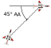

# BFM Concepts

BFM is not a set of canned maneuvers; rather, it is a dynamic combination
of rolls, turns, and maneuvers to either create or solve a BFM problem. BFM problems can be
created in range, angles, and closure. Each BFM selected is based on solving or creating a
problem while maneuvering in relation to another aircraft. The time and amount of BFM
required depends on ordnance load, threat reaction, and pilot skill. BFM concepts include terms,
which provide a common baseline for BFM discussions.

## Geometry
Understanding several key geometric terms and conditions are crucial in understanding one aircraft's position relative to another.

> 💡 Some terms are normally used only from our perspective as the Fighter, others with the Bandit. 

#### Range
Range is the distance by which the two aircraft are separated.

#### Aspect Angle (AA)
AA describes the relative position of the attacker to the target without regard to the attacker's heading. AA is defined as the angle measured
from the tail of the target to the position of the attacker. From a defensive point of view, this angle is commonly regarded as the AOT.

 

#### Heading Crossing Angle (HCA)
HCA is the heading difference between two aircraft. 
With converging vectors HCA can be measured up to a maximum of 180° for a head-on pass. 
HCA is also referred to as “angle-off".

#### Angle Off Nose (AON)
AON is the angle measured from the nose of one aircraft to the position of the other aircraft. 
Like AA, AON is independent of the heading/longitudinal axis of the other aircraft.
When discussing intercepts AON is also referred to as __Antenna Train Angle (ATA)__.

#### Angle Off Tail (AOT)
AOT is the angle from the longitudinal axis of your airplane to the Bandit, as measured from your tail. 
Note: When the fighter is defensive, AOT and the AA you are showing the Bandit are the same.

## Pursuit Curves
The three pursuit curves are lead, pure, and lag. 
The attacker's nose position and LV placement determine the pursuit curve being flown in relation to the defender's plane of motion (POM).
If the attacker is in the defender's POM, the position of the attacker's nose determines the pursuit curve. 
When the attacker is out of the defender's POM, the pursuit curve is determined by where the present LV will position the aircraft's nose once entering the defender's POM.

#### Lead Pursuit (Nose in Front of the Bandit) 
All else equal, lead pursuit increases closure, increases AA, and decreases range. 
This pursuit curve is typically used offensively during gun employment and, from a defender’s perspective; it helps to generate closure and/or angular problems.

#### Pure Pursuit. (Nose on the Bandit) 
Pure pursuit is useful from an offensive perspective when attempting to achieve a radar lock (boresight) and/or shoot certain missiles. 
Pure pursuit outside the Bandit’s turn circle (TC) increases closure (but at a more moderate rate than lead pursuit), aspect, and AOT. 
Maintaining pure pursuit inside the Bandit’s TC will continue to increase closure, AA and AOT until less than a turn radius from the Bandit. 
When less than a turn radius from the Bandit, closure and angles will increase until the offender either runs out of energy to maintain pure pursuit, or must flow to lag to avoid hitting the defender.”

#### Lag Pursuit (Nose Behind the Bandit)
Normally, lag pursuit decreases closure, decreases AA, and increases range. 
Lag pursuit is often used in BFM to build turning room (TR) and control overtake. 
Excessive lag does, however, remove pressure from the Bandit. 
From an offensive perspective, lag pursuit can help control closure, range, and angular problems. 
Defensively, a Bandit in lag pursuit may offer opportunities to gain energy.

## Turn
Turning allows the pilot to solve range, angle, and closure problems offensively, and to present the same problems defensively.
For best turn performance, use available G to solve the problem with an acceptable specific power (Ps) bleed off. 
How well the aircraft can turn (turn rate and radius) is a function of TAS and available G.

#### Rate
Turn rate is defined in terms of the number of degrees per second (deg/sec) of heading change on a given TC. 
All else being equal, the aircraft with the higher turn rate travels around the circle quicker and either generates or solves BFM problems better than the aircraft with the slower turn rate.

#### Radius
Radius is one-half the size of an aircraft's TC.
All else being equal, the aircraft with the smaller turn radius is capable of creating/solving problems in range, closure, and angles better than the aircraft with the larger turn radius.
Offensively, a smaller turn radius permits a turn inside the defender’s TC to achieve a weapons solution while maintaining an offensive advantage. 
Defensively, a smaller turn radius will deny a weapons solution and force the offender to fly outside the TC (assuming both aircraft remain in the same POM).

## LOSR
LOSR is the speed with which the LOS is changing. 
Fighter pilots also use LOSR for assessment during BFM. 
LOSR describes the Bandit’s apparent motion across the canopy as observed by the pilot sitting in the cockpit. 
For example, an airplane that is flying perpendicular to your flightpath and in front of you may have an LOS from left to
right.
During BFM, we describe the LOS with regard to direction and rate. 
It is important to remember that LOSR is relative to your aircraft. 
LOS is also described with respect to rate.
A Bandit that moves aft very quickly has a high LOSR aft, while a Bandit that moves slowly toward the front of your jet has a low forward LOSR. 
The actual motion of the airplane may be different than the LOSR. 
Use LOS direction and rate to determine where you are in relation to the TC, and also to determine what the Bandit is
doing for the purposes of predicting what he will do next.
It is very important to keep track of the LOSR of the Bandit during the fight. 
LOSR is generally described as either forward or aft. 
Forward LOSR means the Bandit’s apparent motion is from the back of your jet to the front. 
That is to say, from the tail to the nose. 
Aft LOSR is just the opposite. 
The Bandit’s apparent motion is from your nose to your tail. 
LOSR is not dependent on the Bandit’s heading, pursuit curve, or AA.

## Control Zone (CZ) 
The CZ is defined as having 2,500 to 4,500 feet of slant range and within a 25° to 45° cone.

## LV 
Roll and yaw allows the pilot to position the LV (a line
perpendicular to the wings out the top of the canopy to infinity), thus determining the
POM in which the aircraft will turn. POM is the plane the aircraft is traveling through and
will vary with the given LV placement, amount of yaw present, angle of attack (AOA), G,
and airspeed.

## Turning Room
Turning room is any displacement from the Bandit's flightpath in any plane. 
The goal is to take advantage of available TR to either gain a position of
advantage against a defender or create problems for the offender. 
An important point to remember is that TR for the attacker is also TR for the defender in most cases. Exclusive
TR, however, exists when one aircraft can take advantage of TR but the other cannot (for
example, in a high-aspect, low-altitude pass where the high fighter is less than one TC
above the ground and the low fighter is executing a pure low-to-high conversion. In this
case, a majority of the TR is usable only by the low fighter since the high fighter would
strike the ground if attempting to use it).

#### Offensive
The goal of the offender is to take full advantage of TR that
cannot be denied by the Bandit, which when inside the TC, is in the Bandit’s POM. If
needed, the offender can build TR in the Bandit’s POM by using lag pursuit.
Whenever the Bandit’s POM changes, it may provide the offender with additional TR
the Bandit cannot use due to relative energy states.

#### Defensive
With the Bandit outside the defender’s TC, the defender can deny
the attacker TR by turning with the LV on or near the Bandit. Once the attacker is
inside the TC, the defender can only deny TR if the Bandit is out of the defender’s
established POM, energy allowing (for example, the offender enters the TC 500 feet above the defender’s POM. The defender can only deny TR by changing the POM
upward toward the offender).

#### High Aspect
Premerge, high-aspect TR may be in the vertical, horizontal,
or a combination of both. Turning room is not always equally usable by both fighters,
as discussed previously. The goal of each fighter approaching a high-aspect merge is
to use TR to reduce HCA prior to the merge (for example, take lead turn).