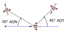

# Test

# Introduction

These Fighter Fundamentals (FF) are an entry to learning effective tactical employment.
A simple language is used to help non-native English speakers. 
As the name suggests this book only contains core concepts.
There is no aircraft specific information or detailed tactics.

So in summary this manual attempts to pick you up as a new learner trying to employ 3rd and 4th generation aircraft in flight simulators.
You will learn everything you need to get a good start and not get lost in a wide ocean of snippets of information.

Fighter

This book is based on the [US Airforce Air Education And Training And Procedures Command's "Introduction to
Fighter Fundamentals (IFF)"](https://static.e-publishing.af.mil/production/1/aetc/publication/aetcttp11-1/aetcttp11-1.pdf).

> 💡  Hints are marked by  a light bulb. 

> 💡 Common established terms are marked by a 📌 and listed in the [Glossary](Glossary.md#terms)[^testnote].

# Chapters

 - [Formation](./Form/intro.md)
 - [BFM](./BFM/BFM_intro.md)

 This is an example of a footnote[^note].

  This is an example of a footnote2[^note2].

1. [ ] empty
1.  [x] with x

[^testnote]: Wow this works

[^note]: This text is the contents of the footnote, which will be rendered
    towards the bottom.

[^note2]: This text is the contents of the footnote2, which will be rendered
towards the bottom.
